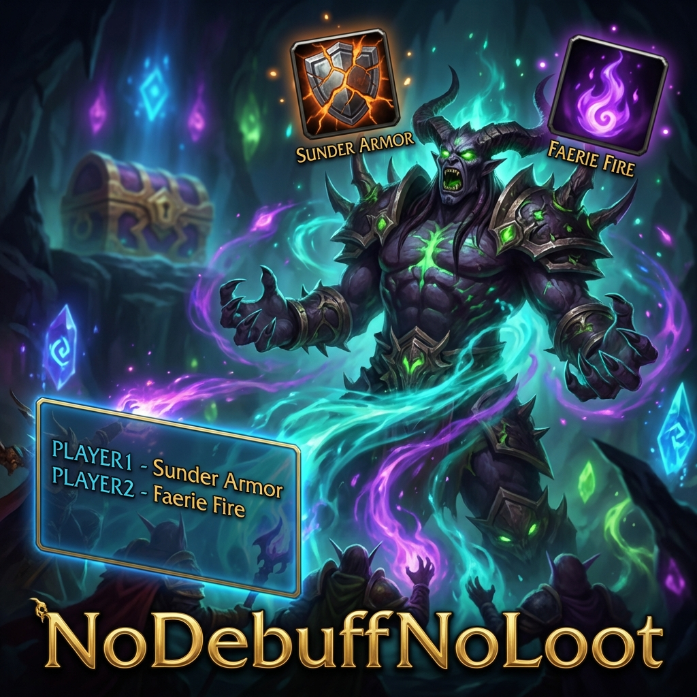

# NoDebuffNoLoot (TBC)

Addon designed to optimize raid performance in World of Warcraft TBC by strictly tracking critical debuffs on bosses.

## What does NoDebuffNoLoot do?

The addon identifies which essential debuffs (such as *Sunder Armor* or *Faerie Fire*) are missing from your target. Unlike other generic trackers, **NoDebuffNoLoot** allows you to assign each debuff to a specific raid player, making the responsibility for maintaining the debuff clear and visible to everyone.

### Information provided by the Addon:
*   **Dynamic Visual HUD**: A floating panel that shows icons for tracked debuffs.
    *   **Green**: The debuff is active and has enough time left (> 5s).
    *   **Yellow**: The debuff is about to expire (< 5s). Urgent renewal needed!
    *   **Red**: The debuff is not present on the boss.
*   **Player Identification**: The HUD shows the assigned player's name next to each debuff.
*   **Critical Alerts**: If you are responsible for a debuff and it is missing or about to expire, you will receive a visual alert in the center of your screen.

## Chat Commands

| Command | Action |
| :--- | :--- |
| `/ndnl` | Opens the configuration panel (Blizzard Menu). |
| `/ndnlsync` | Forces manual synchronization of assignments with all raid members using the addon. |

## Available Options

From the configuration panel (`/ndnl`), you can:
1.  **Enable/Disable HUD**: Hide the panel if you don't need it.
2.  **Manage Assignments**: A complete list of supported debuffs where you can type the name of the responsible player (e.g., "Pepito" for *Sunder Armor*).
3.  **Automatic Sync**: When changing an assignment while in a group, the addon will attempt to send changes automatically to others.

## Tracked Debuffs by Class

| Class | Supported Spells |
| :--- | :--- |
| **Warrior** | Sunder Armor, Thunder Clap, Demoralizing Shout |
| **Druid** | Faerie Fire, Demoralizing Roar |
| **Hunter** | Hunter's Mark, Scorpid Sting |
| **Paladin** | Judgement of Light, Judgement of Wisdom, Judgement of the Crusader |
| **Warlock** | Curse of Elements, Curse of Recklessness, Curse of Weakness |

## Installation
1.  Download the repository.
2.  Copy the `NoDebuffNoLoot` folder into your `Interface/AddOns/` directory.
3.  Ensure the libraries in the `Libs` folder are present.

---

# NoDebuffNoLoot (TBC)

Addon diseñado para optimizar el rendimiento de las raids en World of Warcraft TBC mediante el rastreo estricto de los debuffs críticos en jefes.

## ¿Qué hace NoDebuffNoLoot?

El addon identifica qué debuffs esenciales (como *Hendedura de armadura* o *Fuego de hadas*) faltan en tu objetivo. A diferencia de otros rastreadores genéricos, **NoDebuffNoLoot** permite asignar cada debuff a un jugador específico de la raid, haciendo que la responsabilidad de mantener el debuff sea clara y visible para todos.

### Información proporcionada por el Addon:
*   **HUD Visual Dinámico**: Un panel flotante que muestra los iconos de los debuffs rastreados.
    *   **Verde**: El debuff está activo y tiene tiempo suficiente (> 5s).
    *   **Amarillo**: El debuff está a punto de expirar (< 5s). ¡Renovación urgente!
    *   **Rojo**: El debuff no está presente en el jefe.
*   **Identificación por Jugador**: El HUD muestra el nombre del jugador asignado junto a cada debuff.
*   **Alertas Críticas**: Si eres el responsable de un debuff y este falta o va a caducar, recibirás un aviso visual en el centro de tu pantalla.

## Comandos de Chat

| Comando | Acción |
| :--- | :--- |
| `/ndnl` | Abre el panel de configuración (Menú de Blizzard). |
| `/ndnlsync` | Fuerza la sincronización manual de las asignaciones con todos los miembros de la raid que usen el addon. |

## Opciones Disponibles

Desde el panel de configuración (`/ndnl`), puedes:
1.  **Habilitar/Deshabilitar el HUD**: Oculta el panel si no lo necesitas.
2.  **Gestionar Asignaciones**: Un listado completo de los debuffs soportados donde puedes escribir el nombre del jugador responsable (ej. "Pepito" para *Sunder Armor*).
3.  **Sincronización Automática**: Al cambiar una asignación estando en grupo, el addon intentará enviar los cambios automáticamente a los demás.

## Debuffs Rastreados por Clase

| Clase | Hechizos Soportados |
| :--- | :--- |
| **Guerrero** | Sunder Armor, Thunder Clap, Demoralizing Shout |
| **Druida** | Faerie Fire, Demoralizing Roar |
| **Hunter** | Hunter's Mark, Scorpid Sting |
| **Paladín** | Judgement of Light, Judgement of Wisdom, Judgement of the Crusader |
| **Warlock** | Curse of Elements, Curse of Recklessness, Curse of Weakness |

## Instalación
1.  Descarga el repositorio.
2.  Copia la carpeta `NoDebuffNoLoot` en tu directorio `Interface/AddOns/`.
3.  Asegúrate de que las librerías en la carpeta `Libs` estén presentes.
